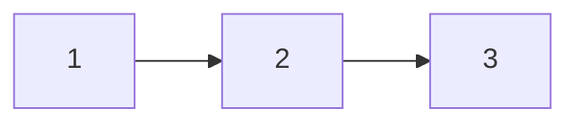
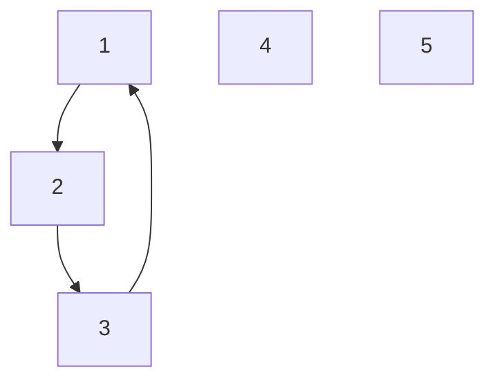
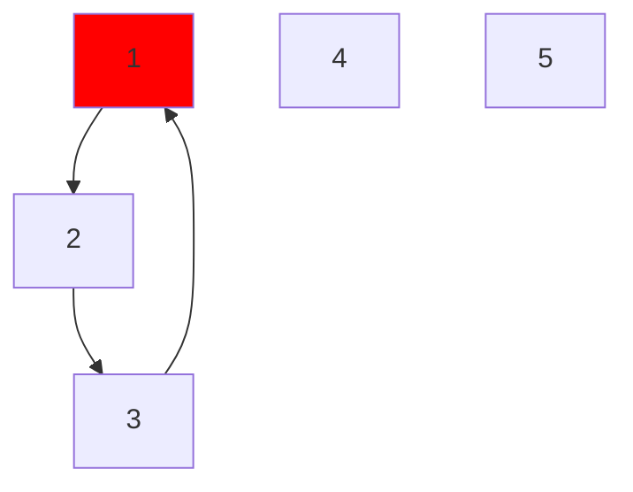
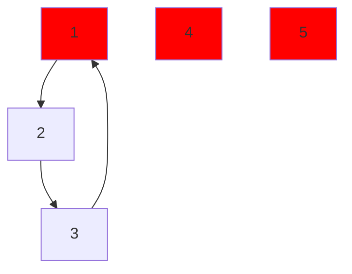
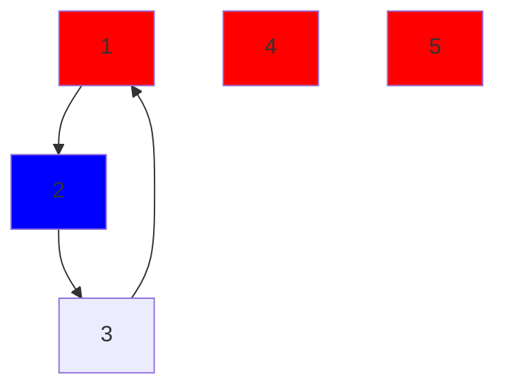
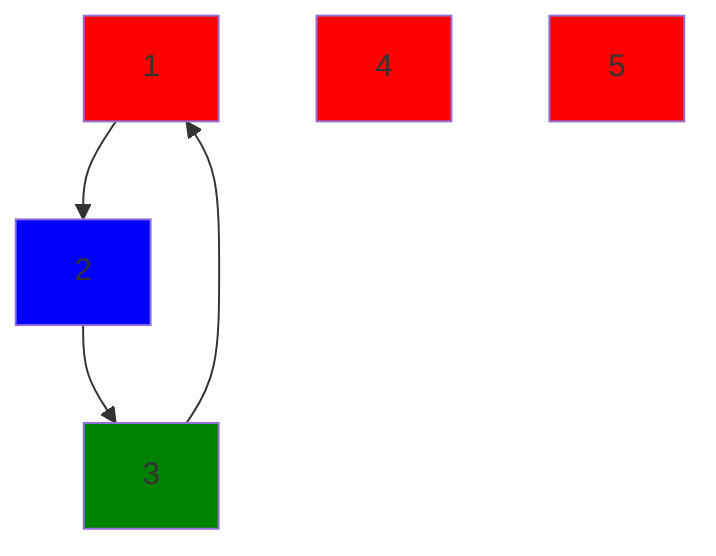

# ⚗️ Potion Disaster - A Fullstack Web-based Puzzle Game
## Tech Stack
         
- Frontend
  - Deployment: Github Pages
  - Environment: Web-based application
  - Framework: Next.js
- REST API
  - Language: Java
  - Deployment: Docker + Render
  - Framework: Java Spring Boot + Maven
- Packaging: Docker
- Language Used
  - Java: API
  - HTML,CSS,TS: Frontend

Potion Disaster is a **_Full-Stack_** web-based puzzle game where frontent is powered by **_Next.js_** framework and the API is powered by **_Spring Boot + Maven_** framework. The REST API is created to calculated the best solution for the following potion arrangement problem which involes **_Object Orientated Programming_** and **_Algorithms and Data Structures_**.
> [!NOTE]
> **_You can check out my live demo [here](https://th1f.github.io/Fullstack-Potion-Game/)._**
## How to play
### Goal
Your task is to arrange magical potions into different rooms while avoiding dangerous combinations.
### Rules
- Drag and drop potions into different rooms
- Some potions are incompatible and can't be in the same room
- Try to find an arrangement with the least conflicts
- Each level gets progressively harder with:
  - More incompatible combinations
  - Fewer available rooms
  - Different potion types
>[!TIP]
>**You can always see the best possible solution after trying**

## Best Solution Algorithm and Data Structure
### Data Structure
The best solution algorithm uses a data structure of a graphs where each incompatible groups are represented as a graph in which incompatible group [1,2,3] will look like:

Where 1 is incompatible with 2 and 2 is incompatible with 3 (e.g. incompatible potions: "1 + 2" , "2 + 3")
### Algorithm
With the data structure a greedy graph colouring algorithm is used called the [**Welsh-Powell Algorithm**](https://www.geeksforgeeks.org/welsh-powell-graph-colouring-algorithm/) where the colors represents the room numbers and the nodes represents the potion ids. An example algorithm is provided below:
#### Example
In this example we will have:
- 5 different potions
- 3 available rooms
- incompatible group:
  - 1 and 2
  - 2 and 3
  - 3 and 1
With the following parameter the graph will look like:

#### Step 1
Color an uncolored node with the highest degree

#### Step 2
Color uncolored non-adjacent nodes with the same color

#### Step 3
Color an uncolored node with the highest degree

#### Step 4
Color uncolored non-adjacent nodes with the same color (This step will be skipped as there are none)

#### Step 5
Color an uncolored node with the highest degree

#### Step 6
As all nodes has been colored the potions are then assigned to the to the rooms according to the colors assigned
- ROOM 1: 1,4,5
- ROOM 2: 2
- ROOM 3: 3

With this we achive a 0 conflict and the best possible solution

## Want to run this localy ?
>[!TIP]
>**To run this locally you will need:**
>- Java JDK17
>- Maven
>- npm
1. Clone this repository
3. Direct to the api folder ``api/`` and start the local host 
4. Direct to the frontend ``./`` and start and host the frontend by using ``npm run dev``

